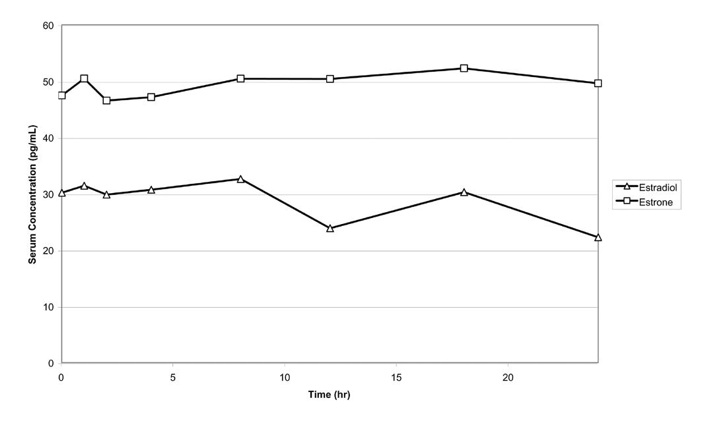

<section class="box">

**译者按：** 本文翻译自法杏制药（Besins Healthcare）旗下子公司：美国 Ascend Therapeutics 公司的雌二醇凝胶（EstroGel）说明书，原件已被美国 FDA 批准。原件地址：<https://www.accessdata.fda.gov/drugsatfda_docs/label/2023/021166s018lbl.pdf>\
注意，该凝胶剂与中国大陆上市的“[爱斯妥]()”同源，唯一不同在于包装形式：本品系泵动定量给药包装。类似包装还见于加拿大 Organon Estrogel、欧盟区 Gynokadin 等品牌。另，本文所示剂量不一定适用于性别肯定激素治疗，应酌情调整。

首次核准日期：1975 年\
修改日期：2023 年 12 月\
翻译日期：2024 年 4 月 2 日\
**请仔细阅读说明书并在医师指导下使用**

**目录：**

- [处方用说明书摘要]()
- [处方用说明书详情]()
- [患者用说明书]()
- [用药指导]()

</section>

## 品名 {#name}

**EstroGel&reg; 0.06%（雌二醇凝胶）外用药** *（以下简称“本品”）*

## 处方说明书摘要 {#highlights}

以下摘要内容不足以确保本品使用的安全性与有效性。请参见[说明书详情]()。\
美国首次核准日期：1975 年

> **警告：子宫内膜癌、心血管疾病、疑似痴呆和乳腺癌风险**  
> *详情参见说明书正文的[置顶警告说明]()*

**<u>雌激素单药治疗：</u>**

- **有子宫的妇女使用不受控雌激素，有更高的子宫内膜癌风险** ([5.2]())
- **“妇女健康倡议”（WHI）雌激素单药研究报告了卒中和深静脉血栓（DVT）风险升高** ([5.1]())
- **WHI 附属认知研究（WHIMS）的雌激素单药子研究报告了 65 岁以上绝经后妇女的疑似痴呆风险升高** ([5.3]())
- **雌激素单药治疗不得用于预防心血管疾病或痴呆** ([5.1](), [5.3]())

**<u>雌激素—孕激素联合治疗：</u>**

- **WHI 雌激素—孕激素复方研究报告了肺栓塞（PE）、DVT、卒中和心肌梗死（MI）风险升高** ([5.1]())
- **WHI 雌激素—孕激素复方研究报告了浸润性乳腺癌风险升高** ([5.2]())
- **WHIMS 雌激素—孕激素复方子研究报告了 65 岁以上绝经后妇女的疑似痴呆风险升高** ([5.3]())
- **雌激素—孕激素联合治疗不得用于预防心血管疾病或痴呆** ([5.1](), [5.3]())

> **最近一次主要更新**

- 2023 年 12 月——[警告和注意事项：恶性肿瘤]() (5.2)

> **适应症**

本品是一种雌激素制剂，用于：

- 治疗更年期引起的中、重度血管舒缩性症状。[(1.1)]()
- 治疗更年期引起的中、重度外阴和阴道萎缩。[(1.2)]()

> **用法用量**

本品有定量挤压泵：每日使用本品 1.25 g（按压一泵），涂抹于手臂。\([2.1](), [2.2]())

> **成分与定量**

本品每泵可给予凝胶 1.25 g，其中含雌二醇 0.75 mg。[(3)]()

> **禁忌症**

- 未确诊的阴道异常出血 ([4](), [5.2]())
- 乳腺癌，或有既往史 ([4](), [5.2]())
- 雌激素依赖性肿瘤 ([4](), [5.2]())
- 现有 DVT、PE，或有既往史 ([4](), [5.1]())
- 现有动脉血栓性疾病（如卒中或心肌梗死），或有既往史 ([4](), [5.1]())
- 已知对本品有超敏反应或血管性水肿 ([4]())
- 肝功能不全或肝脏疾病 ([4](), [5.10]())
- 现有 C 蛋白、S 蛋白或抗凝血酶不足，或有其它血栓性疾病 ([4]())

> **警告和注意事项**

- 雌激素可增加胆囊疾病风险。 ([5.4]())
- 如出现重度高钙血症、失明、重度高甘油三酯血症或胆汁郁积性黄疸，停用雌激素。 ([5.5](), [5.6](), [5.9](), [5.10]())
- 如妇女正接受甲状腺素替代治疗，监测甲状腺功能。([5.11](), [5.20]())

> **不良反应**

与本品相关的常见（&ge;5%）不良反应有：头痛、胀气、乳房疼痛。[(6.1)]()

**如需报告任何疑似不良反应，请拨打美国 ASCEND Therapeutics&reg; 有限公司电话：1-877-204-1013，或致电美国 FDA：1-800-FDA-1088 或登录 <https://www.fda.gov/medwatch>。**

> **药物相互作用**

CYP3A4 诱导剂/抑制剂可能影响雌激素代谢，使其血浆浓度降低或升高。[(7.1)]()

**[对患者的劝告提示]()与 FDA 批准的[患者用说明书]()请见文末。**

**修订日期：2023 年 12 月**

--------

## 处方说明书正文 {#full-info}

<section class="box">

### 警告：子宫内膜癌、心血管疾病、疑似痴呆和乳腺癌风险 {#boxed-warning}

#### <u>雌激素单药治疗</u> {#estrogen-alone-therapy}

> **子宫内膜癌风险**

不受控的雌激素用于子宫完整的妇女，可提高其子宫内膜癌风险。已知在雌激素治疗中加用一种孕激素制剂，可降低子宫内膜增生（可能是子宫内膜癌之前兆）的风险。\
如绝经后妇女出现未确诊的持续或反复性异常阴道出血，应采取适当的诊断手段以排除恶性病变（包括酌情进行定向或随机子宫内膜取样）。\
——参见“警告和注意事项”[(5.2)]()

> **心血管疾病风险和疑似痴呆风险**

据美国“妇女健康倡议”（WHI）雌激素单药研究报告，绝经后妇女（50～79 岁）每日以口服结合雌激素（CE，0.625 mg/天）单药治疗，持续 7.1 年，其患卒中与深静脉血栓（DVT）的风险增加。——参见“警告和注意事项”\([5.1]()) 和“临床研究资料”\([14.3]())

WHI 附属认知研究（WHIMS）中的雌激素单药研究报告，绝经后妇女（65 岁或以上）以 CE（0.625 mg/天）单药治疗 5.2 年后，其发生疑似痴呆的风险较安慰剂组有所增长。尚不清楚该结果是否对较年轻的绝经后妇女适用。——参见“警告和注意事项”[(5.3)]()、“特殊人群用药”[(8.5)]()和“临床研究资料”\([14.4]())

雌激素单药治疗不得用于预防心血管疾病或痴呆。——参见“警告和注意事项”\([5.1](), [5.3]()) 和“临床研究资料”\([14.3](), [14.4]())

WHI 雌激素单药研究仅涉及 CE 0.625 mg/天。因此，尚不清楚 WHI 有关恶性心血管事件和痴呆的结果是否适用于低剂量 CE、其它用药途径或其它雌激素单方制剂。因缺乏相关资料，故不能排除其它制剂有同样风险的可能，也不能判断具体风险程度。应就患者个体的风险状况，与患者讨论雌激素单药治疗的收益和风险。

雌激素以及加用的孕激素均应按每名患者的情况，在确保疗效、控制风险的前提下，以最小有效剂量、最短使用时长开出。

#### <u>雌激素—孕激素联合治疗</u> {#estrogen-plus-progestin-therapy}

> **心血管疾病和疑似痴呆风险**

据 WHI 雌激素、孕激素复方研究报告，绝经后妇女（50～79 岁）接受口服 CE（0.625 mg/天）、醋酸甲羟孕酮（MPA，2.5 mg/天）联合治疗 5.6 年后，其 DVT、肺栓塞（PE）、卒中与心肌梗死（MI）患病风险较安慰剂组有所提高。——参见“警告和注意事项”\([5.1]()) 和“临床研究资料”\([14.3]())

WHI 附属的 WHIMS 雌激素、孕激素复方研究报告，绝经后妇女（65 岁或以上）接受 CE（0.625 mg/天）、MPA（2.5 mg）联合治疗 4 年后，其出现疑似痴呆的风险较安慰剂组有所增长。尚不清楚该结果是否对较年轻的绝经后妇女适用。——参见“警告和注意事项”[(5.3)]()、“特殊人群用药”[(8.5)]()和“临床研究资料”\([14.4]())

雌激素—孕激素联合治疗不得用于预防心血管疾病或痴呆。——参见“警告和注意事项”\([5.1](), [5.3]()) 和“临床研究资料”\([14.3](), [14.4]())

> **乳腺癌风险**

WHI 雌激素、孕激素复方研究还表明，浸润性乳腺癌的患病风险有所增长。——参见“警告和注意事项”\([5.2]()) 和“临床研究资料”\([14.4]())

WHI 雌激素—孕激素复方研究仅涉及口服 CE 0.625 mg/天和 MPA 2.5 mg/天。因此，尚不清楚 WHI 有关恶性心血管事件和痴呆的结果是否适用于低剂量 CE 和其它剂量下的 MPA、其它用药途径或其它雌激素/孕激素制剂。因缺乏相关资料，故不能排除其它制剂有同样风险的可能，也不能判断具体风险程度。应就患者个体的风险状况，与患者讨论雌激素—孕激素联合治疗的收益和风险。

雌激素以及加用的孕激素均应按每名患者的情况，在确保疗效、控制风险的前提下，以最小有效剂量、最短使用时长开出。

</section>


### 一、适应症 {#indications}

1. **更年期引起的中、重度血管舒缩性症状。**
1. **更年期引起的中、重度外阴和阴道萎缩。**

> **限制使用事项**

如仅针对更年期引起的中、重度外阴和阴道萎缩进行处方，应优先考虑阴道外用制剂。


### 二、用法用量 {#dosage-admin}

对于有子宫的绝经后妇女，在开出雌激素时一般需考虑加用一种孕激素，以降低子宫内膜癌风险。对于无子宫的妇女，一般无需加用孕激素；但如有子宫内膜异位病史，可能仍需加用。——参见“警告和注意事项”([5.2](), [5.14]())

雌激素以及加用的孕激素均应按每名患者的情况，在确保疗效、控制风险的前提下，以最小有效剂量、最短治疗时长使用。应视临床状况定期进行利弊权衡再评估，以判断是否仍有必要继续治疗。

#### 2.1 更年期引起的中、重度血管舒缩性症状治疗 {#treatment-vasomotor-symptoms}

本品用于更年期引起的中、重度血管舒缩性症状的治疗时，经批准的单次剂量为 1.25 g/天。尚不清楚本品对于该用途的最低有效剂量。

初次使用前，须先填充好泵头；打开大瓶盖，充分按压泵头 5 次，然后弃置未使用的凝胶（清洗干净，或扔进垃圾桶）。填充后即可开始使用。

建议通过手臂用药。将本品涂抹于手腕至肩部之间的整个手臂，形成薄层，覆盖于内、外侧。

#### 2.2 更年期引起的中、重度外阴和阴道萎缩治疗 {#treatment-vaginal-atrophy}

本品用于更年期引起的中、重度外阴和阴道萎缩的治疗时，经批准的单次剂量为 1.25 g/天。尚不清楚本品对于该用途的最低有效剂量。如仅针对更年期引起的中、重度外阴和阴道萎缩进行处方，应优先考虑阴道外用制剂。

初次使用前，须先填充好泵头；打开大瓶盖，充分按压泵头 5 次，然后弃置未使用的凝胶（清洗干净，或扔进垃圾桶）。填充后即可开始使用。

建议通过手臂用药。将本品涂抹于手腕至肩部之间的整个手臂，形成薄层，覆盖于内、外侧。


### 三、成分与定量 {#forms}

本品为雌二醇透皮凝胶剂。每泵给予凝胶 1.25 g，含雌二醇 0.75 mg。


### 四、禁忌症 {#contraindications}

有以下任意情况的妇女禁用本品：

- 未确诊的阴道异常出血。
   ——参见“警告和注意事项”([5.2]())
- 乳腺癌，或有既往史。
   ——参见“警告和注意事项”([5.2]())
- 雌激素依赖性肿瘤。
   ——参见“警告和注意事项”([5.2]())
- 现有 DVT、PE，或有既往史。
   ——参见“警告和注意事项”([5.1]())
- 现有动脉血栓性疾病（如卒中或心肌梗死），或有既往史。
   ——参见“警告和注意事项”([5.1]())
- 已知对本品有超敏反应或血管性水肿。
- 肝功能不全或肝脏疾病。
- C 蛋白、S 蛋白或抗凝血酶不足，或有其它血栓形成性疾病。


### 五、警告和注意事项 {#warnings}

#### 5.1 心血管疾病 {#cardiovascular-disorders}

已有雌激素单药治疗引起卒中和深静脉血栓（DVT）风险增加的报告。\
已有雌激素—孕激素联合治疗引起肺栓塞（PE）、DVT、卒中和心肌梗死（MI）风险增加的报告。\
如出现以上事件或有疑似征兆，应立即停止雌激素或雌、孕激素治疗。

对以下风险因素应对症处置：

- 动脉疾病风险因素，如高血压、糖尿病、吸烟、高胆固醇水平和肥胖等
- 静脉血栓栓塞（VTE）风险因素，如有 VTE 既往史或家族史、肥胖、系统性红斑狼疮等

> **卒中**

据 WHI 雌激素单药研究报告，50～79 岁妇女给予 CE（0.625 mg/天）单药治疗，其卒中风险相较同年龄安慰剂组有统计意义的增长：治疗组每万人·年 45 例，安慰剂组 33 例。风险增长在治疗第一年显现，此后增长持续。——参见“临床研究资料”\([14.3]())\
如出现卒中或有疑似征兆，应立即停止雌激素单药治疗。\
分组分析表明，50～59 岁妇女给予 CE（0.625 mg/天）单药治疗，其卒中风险相较安慰剂组未见增长：治疗组每万人·年 18 例，安慰剂组 21 例。<sup>[1]</sup>

据 WHI 雌激素—孕激素复方研究报告，50～79 岁妇女给予 CE（0.625 mg/天）、MPA（2.5 mg/天）联合治疗，其卒中风险相较同年龄安慰剂组有统计意义的增长：治疗组每万人·年 33 例，安慰剂组 25 例。风险增长在治疗第一年显现，此后增长持续。——参见“临床研究资料”\([14.3]())\
如出现卒中或有疑似征兆，应立即停止雌激素—孕激素联合治疗。

> **冠心病**

据 WHI 雌激素单药研究报告，妇女给予雌激素单药治疗后，CHD 事件（含非致命性心梗、静息性心梗和 CHD 猝死）之风险率相较安慰剂组总体未受影响。<sup>[2]</sup> ——参见“临床研究资料”\([14.3]())”\
分组分析表明，50～59 岁妇女（围绝经期开始不足 10 年）给予 CE（0.625 mg/天）单药治疗，其卒中风险相较安慰剂组有所降低，但无统计意义：治疗组每万人·年 8 例，安慰剂组 16 例。<sup>[1]</sup>

据 WHI 雌激素—孕激素复方研究报告，妇女给予 CE（0.625 mg/天）、MPA（2.5 mg/天）联合治疗后，CHD 事件风险率相较安慰剂组有所增加，但无统计意义：治疗组每万人·年 41 例，安慰剂组 34 例。相对风险率在治疗第一年可见增长，此后第 2～5 年有下降趋势。——参见“临床研究资料”\([14.3]())

一项有关心血管疾病二线预防的临床对照试验中（“心脏与雌激素/孕激素替代治疗研究”；HERS），有心脏病史的绝经后妇女（2763 人，平均年龄 66.7 岁）给予 CE（0.625 mg/天）、MPA（2.5 mg/天）联合治疗，该疗法对心血管未见任何收益。平均跟踪 4.1 年后，曾确诊冠心病的绝经后妇女使用该疗法，未降低 CHD 事件的总体发生率。治疗第一年，治疗组的 CHD 事件发生率高于安慰剂组；但此后发生率一致。\
参与 HERS 的受试者中，有 2321 人同意参与另一项非盲延伸试验，即 HERS II。该试验的平均跟踪期为 2.7 年，与 HERS 相加即为 6.8 年。治疗组和安慰剂组的 CHD 事件发生率，在 HERS、HERS II 以及综合二者来看均相当。

> **静脉血栓栓塞**

据 WHI 雌激素单药研究报告，妇女给予 CE（0.625 mg/天）单药治疗后，其 VTE（含 DVT 及 PE）风险率相较安慰剂组有所增长：治疗组每万人·年 30 例，安慰剂组 22 例。但是，仅 DVT 风险的增长具备统计意义：治疗组每万人·年 23 例，安慰剂组 15 例。VTE 风险的增长在治疗第一、二年显现。<sup>[3]</sup> ——参见“临床研究资料”\([14.3]())\
如出现 VTE 或有疑似征兆，应立即停止雌激素单药治疗。

据 WHI 雌激素—孕激素复方研究报告，妇女给予 CE（0.625 mg/天）、MPA（2.5 mg/天）联合治疗后，VTE 风险率相较安慰剂组增长一倍，且有统计意义；而 DVT、PE 风险同样有统计意义地增长：

- VTE：治疗组每万人·年 35 例，安慰剂组 17 例
- DVT：治疗组每万人·年 26 例，安慰剂组 13 例
- PE：治疗组每万人·年 18 例，安慰剂组 8 例

VTE 风险的增长在治疗第一年显现，此后增长持续。<sup>[4]</sup> ——参见“临床研究资料”\([14.3]())\
如出现 VTE 或有疑似征兆，应立即停止雌激素—孕激素联合治疗。

如果可能，在接受可能引起血栓栓塞风险增加的手术之前，应提前 4～6 周以上停用雌激素；需长期固定时，也应停用雌激素。

#### 5.2 恶性肿瘤 {#malignant-neoplasms}

> **子宫内膜癌**

已有子宫完整的妇女使用不受控雌激素治疗导致子宫内膜癌风险增加的报告。报告中，使用不受控雌激素后，患者的子宫内膜癌风险增至未使用者的 2～12 倍；风险与治疗时长和雌激素剂量有关。\
多数研究表明，雌激素使用不足一年时，不会使该风险明显增加。长期使用雌激素与更高的风险有关，其中用药 5～10 年后，风险增至 15～24 倍；且停药后至少 8～15 年内，风险仍会维持。

有必要对所有服用雌激素单药或雌、孕激素复方的妇女进行临床监测。如绝经后妇女有未确诊的持续、或反复的阴道异常出血，应采取适当的诊疗手段（如酌情进行定向或随机子宫内膜取样），以排除恶性病变。

无证据表明天然雌激素在与人工雌激素等效的剂量下，导致的子宫内膜癌风险与人工雌激素不同。已证实在雌激素治疗中加用一种孕激素，可降低子宫内膜增生（可能是子宫内膜癌之前兆）的风险。

> **乳腺癌**

WHI 雌激素单药研究（CE 0.625 mg/天）提供了有关雌激素单药与乳腺癌之关系的资料。据研究报告，平均跟踪 7.1 年后，CE 单药治疗组的浸润性乳腺癌风险未见增长（相对风险率：0.80）。<sup>[5]</sup> ——参见“临床研究资料”\([14.3]())

据 WHI 雌激素—孕激素复方研究（CE 0.625 mg/天 + MPA 2.5 mg/天）报告，平均跟踪 5.6 年后，CE—MPA 联合治疗组的浸润性乳腺癌风险相较安慰剂组有所提高。其中，有 26% 的妇女报告早前曾使用雌激素单药或雌激素—人工孕激素复方治疗。相对安慰剂组，CE—MPA 联合治疗组的浸润性乳腺癌风险比率为 1.24，绝对风险率为每万人·年 41 例（安慰剂组：33 例）。\
在有激素治疗史的妇女中，CE—MPA 联合治疗组的浸润性乳腺癌相对风险率为 1.86，绝对风险率为每万人·年 46 例（安慰剂组：25 例）。\
在从未接受激素治疗的妇女中，CE—MPA 联合治疗组的浸润性乳腺癌相对风险率为 1.09，绝对风险率为每万人·年 40 例（安慰剂组：36 例）。\
该研究中，相较安慰剂组，CE—MPA 联合治疗组的浸润性乳腺癌病灶更大，检出淋巴结阳性的比例更高，癌症确诊时的阶段也更晚。罕有转移性癌症的报告；两组之间的报告率无明显差异。其它预后因素（如组织学亚型、分级和激素受体状态等）在两组之间未见有差异。<sup>[6]</sup> ——参见“临床研究资料”([14.3]())

与此类似，已有观察性研究报告，连续多年使用雌、孕激素复方治疗导致了乳腺癌风险增加，而雌激素单药引起了较小的风险增加。一项针对诸前瞻性群体研究的大型荟萃分析表明，风险的增加和用药时长相关，且该风险在停药后至少十年内仍然维持。WHI 试验的后续研究也表明，雌、孕激素复方治疗和乳腺癌风险增长有关。\
观察性研究表明，相比于雌激素单药治疗，雌、孕激素复方治疗引起乳腺癌的风险更高，显性化更早。此类研究基本上未发现不同配方、剂量或给药途径的雌、孕激素复方在乳腺癌风险上有任何明显差异。

已有使用雌激素单药和雌、孕激素复方治疗导致乳腺 X 光异常结果（需进一步排查）增加的报告。

妇女应每月进行一次乳房自查，每年由医师进行一次乳房检查。此外，依患者年龄、风险因素和早前乳腺 X 光结果，应安排进行乳腺 X 光扫描。

> **卵巢癌**

WHI 雌激素—孕激素复方研究中，卵巢癌风险有所增加，但无统计意义。平均跟踪 5.6 年后，CE、MPA 治疗组相对安慰剂组的卵巢癌风险比率为 1.58（95% 置信区间 0.77～3.24），绝对风险率为每万人·年 4 例（安慰剂组：3 例）。<sup>[7]</sup>

对 17 项前瞻性、35 项回顾性流行病学研究的荟萃分析发现，曾服用激素以治疗更年期症状的妇女有更高的卵巢癌风险。其中，对来自 17 项前瞻性研究的 12,110 例卵巢癌病例以对照比较的方式进行初步分析。与现行激素治疗相关的卵巢癌相对风险率为 1.41（95% 置信区间 1.32～1.50）。不同激素暴露时长之间未产生风险率估测值的差异；即，确诊前暴露 5 年以下（中位数 3 年）和确诊前暴露 5 年以上（中位数 10 年）未产生这种差异。然而，尚不清楚卵巢癌风险的增加究竟与多长时间的激素治疗有关。

#### 5.3 疑似痴呆 {#probable-dementia}

WHI 附属认知研究（WHIMS）的雌激素单药子研究中，有 2947 名已切除子宫的 65～79 岁妇女被随机分配到 CE（0.625 mg/天）单药治疗组或安慰剂组。\
平均跟踪 5.2 年后，治疗组和安慰剂组分别有 28 名和 19 名妇女被确诊疑似痴呆。CE 单药治疗组的疑似痴呆相对风险率为 1.49（95% 置信区间 0.83～2.66），绝对风险率为每万人·年 37 例（安慰剂组：25 例）。<sup>[8]</sup> ——参见“特殊人群用药”\([8.5]()) 和“临床研究资料”\([14.4]())

WHIMS 雌激素—孕激素复方研究中，有 4532 名已绝经的 65～79 岁妇女被随机分配到 CE（0.625 mg/天）、MPA（2.5 mg/天）联合治疗组或安慰剂组。\
平均跟踪 4 年后，治疗组和安慰剂组分别有 40 名和 21 名妇女被确诊疑似痴呆。CE—MPA 联合治疗组的疑似痴呆相对风险率为 2.05（95% 置信区间 1.21～3.48），绝对风险率为每万人·年 45 例（安慰剂组：22 例）。<sup>[8]</sup> ——参见“特殊人群用药”\([8.5]()) 和“临床研究资料”\([14.4]())

综合以上两批受试者的结果，可知疑似痴呆的相对风险率为 1.76（95% 置信区间 1.19～2.60）。以上研究仅对 65～79 岁妇女进行，其结论是否适用于较年轻的绝经后妇女尚不清楚。——参见“特殊人群用药”\([8.5]()) 

#### 5.4 胆囊疾病 {#gallbladder-disease}

已有绝经后妇女服用雌激素出现胆囊疾病（需手术）的风险增至 2～4 倍的报告。

#### 5.5 高钙血症 {#hypercalcemia}

患有乳腺癌、且骨骼有转移灶的患者，摄入雌激素可能导致重度高钙血症。如发生高钙血症，应停用雌激素（包括本品），并对症治疗，使血钙水平降低。

#### 5.6 视力异常 {#visual-abnormalities}

已有服用雌激素的妇女出现视网膜血管栓塞的报告。如出现急性部分或完全失明，或有急性眼前垂、复视或偏头痛发作，应停药并等待检查。如眼科检查提示视神经盘水肿或视网膜血管病变，应终身停用雌激素（包括本品）。

#### 5.7 关于未切除子宫的妇女加用一种孕激素的说明 {#addition-progestogen}

已有研究报告，在雌激素序贯治疗中连续 10 日或以上加用一种孕激素，或在雌激素不间断治疗中加入孕激素，可使子宫内膜增生的发生率低于雌激素单药治疗。子宫内膜增生可能是子宫内膜癌之前兆。

但是，相较雌激素单药，加用孕激素可能会带来额外的风险；其中包括乳腺癌风险增加。

#### 5.8 高血压 {#elevated-blood-pressure}

在少量病例报告中，（*人体*）对雌激素的某些特异性反应可导致血压的大幅升高。在一项大型随机安慰剂对照试验中，未发现雌激素对血压有任何普遍性作用。

#### 5.9 高甘油三酯血症的加重 {#exacerbation-hypertriglyceridemia}

对于有高甘油三酯血症既往史的妇女，雌激素治疗可能与血清甘油三酯的升高有关，从而可诱发胰腺炎。如出现胰腺炎，应停用本品。

#### 5.10 肝功能不全和/或有胆汁郁积性黄疸既往史 {#hepatic-impairment-cholestatic-jaundice}

如患者的肝功能不全，雌激素代谢可能较慢。如妇女有因雌激素使用或妊娠引起的胆汁郁积性黄疸既往史，应谨慎治疗，一旦症状复发则应停药。

#### 5.11 甲状腺功能减退的加重 {#exacerbation-hypothyroidism}

使用雌激素可引起甲状腺素结合球蛋白（TBG）水平的升高。甲状腺功能正常的情况下，作为补偿，TBG 升高可引起甲状腺素分泌增加，维持血清游离 T<sub>4</sub>、T<sub>3</sub> 浓度在正常范围。如妇女同时接受甲状腺素替代治疗和雌激素治疗，则可能需提高甲状腺素的剂量。在以本品治疗期间，应监测其甲状腺功能，以确保游离甲状腺素水平维持于合理范围内。

#### 5.12 体液潴留 {#fluid-retention}

雌激素可引起一定程度的体液潴留。如妇女存在可能影响体液潴留的状况（如心功能或肾功能不全），应对其密切观察。当有证据提示临床显著的体液潴留时，应停止雌激素单药治疗（包括本品）。

#### 5.13 低钙血症 {#hypocalcemia}

在副甲状腺功能不全的妇女中，雌激素可引起低钙血症。对此类妇女，应考虑雌激素（包括本品）治疗的收益是否高于风险。

#### 5.14 子宫内膜异位症状的加重 {#exacerbation-endometriosis}

已有数个病例报告已切除子宫的妇女给予雌激素单药治疗后出现体内残余子宫内膜嵌入体的恶性病变。如妇女切除子宫后仍有残余的子宫内膜异位，应考虑加用孕激素。

#### 5.15 遗传性血管性水肿 {#hereditary-angioedema}

对于患有遗传性血管性水肿的妇女，外源性雌激素可能会使其血管性水肿的症状加重。对此类妇女，应考虑雌激素（包括本品）治疗的收益是否高于风险。

#### 5.16 其它症状的加重 {#exacerbation-other-conditions}

雌激素治疗（包括本品）可能导致以下症状加重：哮喘、糖尿病、癫痫、偏头痛、卟啉病、系统性红斑狼疮和肝脏血管瘤。如妇女有以上症状，应考虑雌激素治疗的收益是否高于风险。

#### 5.17 注意：乙醇制剂易燃 {#flammable}

将本品远离明火或烟头，直至完全干燥。

#### 5.18 和保湿霜的并用 {#moisturizer-lotion}

在涂抹本品后一小时使用保湿霜，可使雌二醇的吸收有明显增加。——参见“药理毒理”([12.3]())

#### 5.19 实验室检测事项 {#laboratory-tests}

血清促卵泡激素（FSH）和雌二醇水平，对中、重度血管舒缩症状和中、重度外阴及阴道萎缩的管理不具备参考意义。

#### 5.20 药物与实验室检测指标的相互作用 {#drug-laboratory-test-interactions}

*雌激素可导致：*

- 凝血酶原时间、凝血活酶时间、血小板凝聚时间加快；\
   血小板计数增加；\
   凝血因子 II、VII 抗原、VIII 抗原、VIII 促凝活性、IX、X、XII、VII-X 复合物和 II-VII-X 复合物增加；\
   β-血小板球蛋白增加；\
   凝血因子 Xa 抗体水平，抗凝血酶 III 水平及活性下降；\
   纤维蛋白原水平及活性升高；\
   纤溶酶原抗原及活性升高。
- 甲状腺素结合球蛋白（TBG）水平升高，从而总循环甲状腺素升高——通过对蛋白结合碘（PBI）、T<sub>4</sub>（色谱柱法或放射免疫法）、T<sub>3</sub>（放射免疫法）水平的测定而得；\
   T<sub>3</sub> 再摄取减少，反映出 TBG 水平的升高；\
   游离 T<sub>4</sub>、游离 T<sub>3</sub> 水平不变；\
   如妇女正接受甲状腺素替代治疗，可能需增加甲状腺素剂量。
- 其它血清结合蛋白的增加，包括皮质类固醇结合球蛋白（CBG）和性激素结合球蛋白（SHBG）等，从而导致循环皮质类固醇和性激素等增加；\
   游离睾酮、雌二醇等激素浓度可能下降；\
   其它血浆蛋白可能增加（例如血管紧张素原/肾素底物，α-1-抗胰蛋白酶，血浆铜蓝蛋白等）。
- 血清高密度脂蛋白（HDL）和 HDL<sub>2</sub> 胆固醇亚组分浓度均升高；\
   低密度脂蛋白（LDL）胆固醇浓度降低；\
   甘油三酯水平升高。
- 糖耐量降低。


### 六、不良反应 {#adverse-reactions}

以下严重不良反应已于他处提及：

- **心血管疾病**——见“[文首警告说明]()”和“警告和注意事项”([5.1]())
- **恶性肿瘤**——见“[文首警告说明]()”和“警告和注意事项”([5.2]())

#### 6.1 临床试验报告 {#clinical-trials-experience}

因各临床试验的条件不同，无法将一种药物在临床试验中的不良反应发生率，与另一种药物的不良反应发生率进行直接比较；其也并非反映实际发生率。

有两项对照性充分、为时 12 周的临床试验对本品进行研究。本品 1.25 g 治疗组和安慰剂组当中发生率 &ge;5% 的药物不良反应列于表一。

<section class="box">

**「表一」两项对照充分的临床试验中，本品治疗组，即意向治疗安全性人群发生率 &ge;5% 的药物不良反应**

```csv
系统器官分类,药物不良反应,本品 1.25 g/天治疗组\n（168 人）,安慰剂组\n（73 人）
**全身性疾病**,头痛,9.5,2.7
**消化道疾病**,胀气,5.4,4.1
**泌尿和生殖系统疾病**,乳房疼痛,10.7,8.2
```

</section>

在这两项临床对照试验中，本品治疗组的“**用药部位反应**”报告率为 0.6%。此外还提到瘙痒、皮疹等其它皮肤反应。

#### 6.2 上市后的不良反应报告 {#postmarketing-experience}

本品获准上市以来，发现的不良反应如下。这些不良反应来自使用者自发报告，规模不明，故无法准确估计其发生率、或建立与药物暴露的病理关系。

- **生殖和泌尿系统疾病：** 子宫内膜癌
- **乳房疾病：** 乳房疼痛、乳房紧张感、乳腺癌
- **心血管疾病：** 深静脉血栓、心肌梗死、静脉炎
- **胃肠道疾病：** 恶心、腹胀、腹泻、胃不适
- **皮肤疾病：** 脱发、皮疹、瘙痒、给药部位症状（干皮，疼痛，变色，刺激反应，皮疹等）
- **眼部疾病：** 视网膜静脉阻塞
- **中枢神经系统疾病：** 头痛、眩晕、失眠、感觉减退、脑膜瘤、失语、智力迟钝、感觉异常
- **其它：** 药效不足、潮热、关节痛、盗汗、药效减弱、四肢痛、疲乏、体重增加、疼痛、超敏反应、呼吸急促、恶性间叶瘤、血管性水肿、急性肝炎、面部水肿、意外接触、肌阵挛、步态障碍、面红


### 七、药物相互作用 {#drug-interactions}

体外和体内研究表明，雌激素部分经细胞色素 P450 3A4（CYP3A4）代谢。因此，CYP3A4 诱导剂或抑制剂可能会影响雌激素的代谢。其中：

- CYP3A4 诱导剂：圣约翰草（贯叶连翘）制剂、苯巴比妥、卡马西平与利福平等可降低雌激素的血浆浓度，从而可能减弱其疗效、改变子宫出血谱；
- CYP3A4 抑制剂：红霉素、克拉霉素、酮康唑、伊曲康唑、利托那韦与葡萄柚汁等均可增加雌激素的血药浓度，并可能产生副作用。


### 八、特殊人群用药提示 {#specific-populations}

#### 8.1 妊娠妇女用药 {#pregnancy}

> **概述**

本品不适用于妊娠妇女。尽管目前尚无本品用于妊娠妇女的资料，但在流行病学研究和荟萃分析中发现，受精前或妊娠早期暴露于复方激素类避孕药（含雌激素和人工孕激素），不会导致生殖器或非生殖器先天畸形（如心脏畸形、短肢缺陷等）的风险增加。

在美国一般人群中，临床认可的妊娠当中出现重大先天畸形和流产的背景频率估计值，分别为 2～4% 和 15～20%。

#### 8.3 哺乳期妇女用药 {#lactation}

在哺乳妇女中，雌激素可经乳汁分泌，且可导致乳汁分泌减少。乳汁分泌的减少随时可能发生，但一旦母乳喂养趋于稳定，则该可能性会降低。应综合考虑母乳喂养对婴儿发育和健康的益处和哺乳妇女对本品的临床需求，以及本品或哺乳妇女的其它基础状况对被哺乳婴儿的任何潜在不良影响。

#### 8.4 儿童用药 {#pediatric-use}

本品不适用于儿童患者。尚未对儿童患者用药进行研究。

#### 8.5 老年用药 {#geriatric-use}

现有研究中，对于 65 岁以上老年妇女使用本品的反馈是否与较年轻受试者不同，尚缺乏足够样本来判断。

> **“妇女健康倡议”研究**

据 WHI 雌激素单药研究报告，在给予 CE（0.625 mg/天）单药治疗的妇女中，65 岁以上者的卒中风险相对更高。——参见“警告和注意事项”\([5.1]()) 和“临床研究资料”\([14.3]())

据 WHI 雌激素—孕激素复方研究报告，在给予 CE（0.625 mg/天）、MPA（2.5 mg/天）联合治疗的妇女中，65 岁以上者的非致命性卒中和浸润性乳腺癌风险相对更高。——参见“警告和注意事项”\([5.1]()) 和“临床研究资料”\([14.3]())

> **“妇女健康倡议”认知研究**

WHIMS 研究中，65～79 岁妇女接受雌激素单药或雌激素—孕激素联合治疗后，疑似痴呆风险较安慰剂有所升高。——参见“警告和注意事项”\([5.3]()) 和“临床研究资料”\([14.4]())

两项子研究均仅对 65～79 岁妇女进行，其结论是否适用于较年轻的绝经后妇女尚不清楚。<sup>[8]</sup> ——参见“警告和注意事项”\([5.3]()) 和“临床研究资料”\([14.4]())


### 十、药物过量 {#overdosage}

雌激素摄入过量可引起恶心、呕吐、乳房紧张感、腹痛、困倦和疲乏；妇女可能出现撤退性出血。过量管理措施有停止本品治疗、对症治疗等。


### 十一、药物成分详情 {#description}

本品（雌二醇凝胶）为外用可吸收水醇凝胶，含雌二醇 0.06%，无色、透明，干燥后无臭。每泵给予凝胶 1.25 g，其中含雌二醇 0.75 mg。

雌二醇为白色结晶粉末，化学名称为雌甾-1,3,5(10)-三烯-3,17&beta;-二醇，化学式：C<sub>18</sub>H<sub>24</sub>O<sub>2</sub>，分子量：272.39。化学结构式如下。



本品的活性成分为雌二醇。其余成分均无药理活性，包括：

- 纯净水
- 乙醇
- 三乙醇胺
- 卡波姆 934P


### 十二、药理毒理 {#pharmacology}

#### 12.1 作用机理 {#mechanism-action}

内源性雌激素在促进女性生殖系统和第二性征的发育和维持方面，起到很大作用。人体内诸循环雌激素在代谢相互转化作用下处于动态准平衡，但其中雌二醇是最主要的胞内雌激素，对胞内受体的效力也远高于雌酮、雌三醇等代谢物。

在月经周期正常的成年女性中，雌激素主要来自卵巢卵泡；其每日可分泌 70～500 μg 雌二醇，分泌量依月经周期阶段而异。绝经后，内源性雌激素大多系由肾上腺皮质分泌的雄烯二酮经外周组织转化而来的雌酮；因此，雌酮及其硫酸结合物：硫酸雌酮，构成了绝经后妇女体内循环雌激素的绝大部分。

雌激素通过与靶组织的细胞受体结合而发挥作用。迄今已发现两种雌激素受体；二者在不同组织中的分布比例各异。

循环雌激素可通过一种负反馈机制，调节脑垂体促性腺激素（促黄体激素，即 LH，和促卵泡激素，即 FSH）的分泌。在绝经后妇女中，可见雌激素对这两种激素的水平有降低作用。

#### 12.2 药效学特性 {#pharmacodynamics}

血清雌激素浓度一般不能用于推测妇女个体对本品治疗的反馈，或发生不良结局的风险。同样地，将不同雌激素制剂用于妇女个体时，也可能无法通过药物暴露量的比较来判断其效力或安全性。

#### 12.3 药代动力学特性 {#pharmacokinetics}

> **吸收**

雌二醇遵循被动分布过程，经皮吸收，进入全身循环。吸收速率受角质层扩散速率所限。本品用于皮肤后，需 2～5 分钟干燥。

有 24 名绝经后妇女每日将本品 1.25 g（含雌二醇 0.75 mg）用于手臂后部，持续 14 日。在第 14 日，血清雌二醇、雌酮浓度峰值的平均数分别为 46.4 pg/mL 和 64.2 pg/mL。第 14 日用药后，24 小时平均血清雌二醇、雌酮浓度分别为 28.3 pg/mL 和 48.6 pg/mL。未经修正的第 14 天雌二醇、雌酮平均浓度—时间曲线见图一。

<section class="box">

**「图一」连续 14 日给予本品 1.25 g 之后，未经修正的雌二醇、雌酮平均血清浓度—时间曲线**



</section>

当每日给予本品 2.5 g 时（两臂各涂抹 1.25 g），血清雌二醇浓度于第三日达到稳态。

> **分布**

外源性雌激素的分布特性与内源性雌激素相似。雌激素广泛分布于全身，在性激素靶器官内的分布浓度普遍更高。随血液循环的雌激素大多与 SHBG 和白蛋白结合。

> **代谢**

外源性雌激素遵循内源性雌激素的代谢途径。诸循环雌激素在代谢相互转化作用下处于动态准平衡。雌激素的转化主要经肝脏进行。雌二醇可与雌酮相互转化；二者可转化为雌三醇，后者是经尿液排泄的主要代谢物。\
雌激素在肝脏经硫酸、葡萄糖醛酸化之后，结合物进入肝肠循环，随胆汁排出进入肠道，后经水解被肠道再吸收。在绝经后妇女中，循环雌激素相当一部分由硫酸结合物构成，尤其是硫酸雌酮；其可作为其它更高效力的雌激素的来源。\
本品给予的雌二醇避免了肝脏首过效应，但其临床意义尚不清楚。

> **排泄**

雌二醇、雌酮和雌三醇以葡萄糖醛酸和硫酸结合物的形式，从尿液排出。

给予本品 1.25 g 之后，雌二醇的表观清除半衰期约为 36 小时。

> **清洗用药部位造成的影响**

有 24 名健康绝经后妇女连续 14 日给予本品 1.25 g/天，期间就清洗用药部位对血清雌二醇浓度的影响进行评价。用药后一小时清洗用药部位，导致了血清雌二醇浓度 24 小时均值下降 22%。

> **因身体接触造成雌二醇转移的可能性**

有 24 名健康绝经后妇女持续 14 日通过后臂给予本品 1.25 g/天，期间就雌二醇转移的可能性进行评价。每日用药后一小时，令 24 名未用药的健康绝经后妇女直接接触用药者的用药部位，接触时长为 15 分钟。观察到接触后，未用药者体内的血清雌二醇浓度均值未发生改变。

> **保湿霜/防晒霜对雌二醇吸收的影响**

有一项随机非盲三期交叉试验，就防晒霜和保湿霜用于 42 名健康绝经后妇女时，对经外用 0.06% 雌二醇凝胶给予的雌二醇之吸收的影响进行评价。结果表明，七日内每日给予外用 0.06% 雌二醇凝胶之后一小时涂抹防晒霜，导致雌二醇 24 小时总暴露剂量（AUC<sub>0-24h</sub>）和浓度峰值（C<sub>max</sub>）平均下降 16%；七日内每日给予外用 0.06% 雌二醇凝胶之后一小时涂抹保湿霜，导致雌二醇 AUC<sub>0-24h</sub> 和 C<sub>max</sub> 平均分别上升 38% 和 73%。

尚未就防晒霜/保湿霜先于外用 0.06% 雌二醇凝胶使用时，对雌二醇吸收的影响进行研究。


### 十三、非临床毒理资料 {#nonclinical-toxicology}

#### 13.1 对动物的致癌性、致突变性与不育作用 {#animal-carcinogenesis}

在某些动物种类中，长期连续给予天然和人工雌激素使得乳腺、子宫、宫颈、阴道、睾丸和肝脏癌症的频率增加。


### 十四、临床研究资料 {#clinical-studies}

#### 14.1 本品对绝经后妇女的血管舒缩症状的影响 {#effects-on-vasomotor-symptoms}

有一项安慰剂对照研究，将 145 名绝经后妇女（年龄介乎 29～67 岁，白人占 81.4%）随机分配到本品 1.25 g（雌二醇 0.75 mg）治疗组或凝胶安慰剂组，持续 12 周；在第 4 周和第 12 周评价疗效。第 4 周和第 12 周可见中、重度潮热频率有统计意义的下降。详见表二。

<section class="box">

**「表二」意向治疗人群的日均潮热发病数和症状程度分级平均值变化，基于末次观测值结转**

<table>
<thead>
  <tr>
    <th></th>
    <th colspan="2">日均潮热病例数<br>（中至重度）</th>
    <th colspan="2">日均症状程度分级<br>（轻至重度）</th>
  </tr>
</thead>
<tbody>
  <tr>
    <td></td>
    <td>安慰剂组<br>（73 人）</td>
    <td>Estrogel 治疗组<br>（0.06%, 1.25g）<br>（72 人）</td>
    <td>安慰剂组<br>（73 人）</td>
    <td>Estrogel 治疗组<br>（0.06%, 1.25g）<br>（72 人）</td>
  </tr>
  <tr>
    <td colspan="5"><b>基线</b></td>
  </tr>
  <tr>
    <td>平均值（标准差）</td>
    <td>11.01 (5.66)</td>
    <td>10.33 (3.07)</td>
    <td>2.30 (0.24)</td>
    <td>2.36 (0.29)</td>
  </tr>
  <tr>
    <td colspan="5"><b>第四周</b><sup>(1)</sup></td>
  </tr>
  <tr>
    <td>平均值（标准差）</td>
    <td>5.95 (5.17)</td>
    <td>4.43 (4.13)</td>
    <td>2.00 (0.63)</td>
    <td>1.73 (0.73)</td>
  </tr>
  <tr>
    <td>均值较基线之差（标准差）</td>
    <td>-5.06 (4.91)</td>
    <td>-5.91 (3.68)</td>
    <td>-0.31 (0.62)</td>
    <td>-0.63 (0.71)</td>
  </tr>
  <tr>
    <td>与安慰剂组之差</td>
    <td></td>
    <td>0.85</td>
    <td></td>
    <td>0.32</td>
  </tr>
  <tr>
    <td><i>P</i><sup>(2)</sup></td>
    <td></td>
    <td>0.019<sup>(3)</sup></td>
    <td></td>
    <td>0.005<sup>(3)</sup></td>
  </tr>
  <tr>
    <td colspan="5"><b>第十二周</b><sup>(1)</sup></td>
  </tr>
  <tr>
    <td>平均值（标准差）</td>
    <td>5.17 (6.52)</td>
    <td>2.79 (3.70)</td>
    <td>1.76 (0.84)</td>
    <td>1.33 (0.97)</td>
  </tr>
  <tr>
    <td>均值较基线之差（标准差）</td>
    <td>-5.84 (4.52)</td>
    <td>-7.55 (3.52)</td>
    <td>-0.54 (0.84)</td>
    <td>-1.03 (0.94)</td>
  </tr>
  <tr>
    <td>与安慰剂组之差</td>
    <td></td>
    <td>1.71</td>
    <td></td>
    <td>0.49</td>
  </tr>
  <tr>
    <td><i>P</i><sup>(2)</sup></td>
    <td></td>
    <td>0.043<sup>(3)</sup></td>
    <td></td>
    <td>&lt;0.001<sup>(3)</sup></td>
  </tr>
</tbody>
</table>

(1) 主要监测时间点。  
(2) 以 Elteren 非参数检验取 *P* 值。  
(3) 与安慰剂组之差有统计意义。

</section>

#### 14.2 本品对绝经后妇女的外阴及阴道萎缩的影响 {#effects-on-vaginal-atrophy}

组织活检显示，连续给予本品 1.25 g 至第十二周，阴道壁浅表上皮细胞占比相较基线有明显增加（*P* &le;0.001）。同时观察到安慰剂组的变化不明显。

#### 14.3 美国“妇女健康倡议”研究结果 {#womens-health-initiative-studies}

美国“妇女健康倡议”（WHI）研究招募约 27000 名绝经后妇女（大多健康）参与两项子研究，以评价口服 CE（0.625 mg/天）单药治疗或与 MPA（2.5 mg/天）联合治疗在对某些慢性疾病的作用上，相较安慰剂有何风险及收益。\
治疗中的主要终点为冠心病（CHD，分为非致命性心肌梗死、静息性心梗和 CHD 猝死）发生；治疗中的主要不良结局为浸润性乳腺癌。研究还记录初次发生 CHD、浸润性乳腺癌、卒中、PE、子宫内膜癌（仅限 CE—MPA 复方子研究）、结直肠癌、髋骨骨折或非上述原因导致的死亡的人数，作为“总发病率”（*global index*）。两项子研究均未评价 CE 单药或 CE—MPA 复方对围绝经期症状的作用。

> **WHI 雌激素单药研究**

WHI 雌激素单药研究在早期观察到卒中风险升高，随即被中止；研究认为，无法按预设的主要终点收集更多有关雌激素单药的风险及收益的资料。\
该研究纳入 10739 名妇女（平均年龄 63 岁，范围 50～79 岁；白人占 75.3%，黑人占 15.1%，西班牙裔占 6.1%，其余人种占 3.6%），平均跟踪 7.1 年后所得结果见表三。

<section class="box">

**「表三」WHI 雌激素单药研究中的相对和绝对风险观测结果**<sup>(1)</sup>

| 不良反应事件 | CE 相对安慰剂的风险比率<br>（95% 粗置信区间<sup>(2)</sup>） | CE 治疗组（5310 人）<br>每万人·年绝对风险率 | 安慰剂组（5429 人）<br>每万人·年绝对风险率 |
|-|-|-|-|
| CHD 事件<sup>(3)</sup> | 0.95 (0.78-1.16) | 54 | 57 |
| &nbsp;- *非致命性心梗* <sup>(3)</sup> | 0.91 (0.73-1.14) | 40 | 43 |
| &nbsp;- *CHD 猝死* <sup>(3)</sup> | 1.01 (0.71-1.43) | 16 | 16 |
| 卒中<sup>(3)</sup> | 1.33 (1.05-1.68) | 45 | 33 |
| &nbsp;- *缺血性卒中* <sup>(3)</sup> | 1.55 (1.19-2.01) | 38 | 25 |
| 深静脉血栓<sup>(3)(4)</sup> | 1.47 (1.06-2.06) | 23 | 15 |
| 肺栓塞<sup>(3)</sup> | 1.37 (0.90-2.07) | 14 | 10 |
| 浸润性乳腺癌<sup>(3)</sup> | 0.80 (0.62-1.04) | 28 | 34 |
| 结直肠癌<sup>(5)</sup> | 1.08 (0.75-1.55) | 17 | 16 |
| 髋骨骨折<sup>(3)</sup> | 0.65 (0.45-0.94) | 12 | 19 |
| 腰椎骨折<sup>(3)(4)</sup> | 0.64 (0.44-0.93) | 11 | 18 |
| 下臂/腕骨折<sup>(3)(4)</sup> | 0.58 (0.47-0.72) | 35 | 59 |
| 所有骨折<sup>(3)(4)</sup> | 0.71 (0.64-0.80) | 144 | 197 |
| 非以上原因导致的死亡<sup>(5)(6)</sup> | 1.08 (0.88-1.32) | 53 | 50 |
| 总死亡率<sup>(3)(4)</sup> | 1.04 (0.88-1.22) | 79 | 75 |
| “总发病率”<sup>(7)</sup> | 1.02 (0.92-1.13) | 206 | 201 |

(1) 汇总自 WHI 的多份公开发表材料。材料可于此查阅：<https://www.nhlbi.nih.gov/whi>\
(2) “粗置信区间”即未按多重视图和多重比较进行修正的置信区间。\
(3) 结果基于平均跟踪 7.1 年后集中评审的数据。\
(4) 未纳入“总发病率”统计。\
(5) 结果为平均跟踪 6.8 年后所得。\
(6) 除乳腺癌、结直肠癌、确诊或疑似 CHD、PE、脑血管疾病以外的任何原因导致的死亡。\
(7) “总发病率”包括初次发生 CHD 事件、浸润性乳腺癌、卒中、肺栓塞、结直肠癌、髋骨骨折或非以上原因导致的死亡的人数。

</section>

在被 WHI“总发病率”所纳入的不良反应中，以下不良反应有统计意义的明显变化：<sup>[9]</sup>

- 卒中：每万人·年增加 12 例
- 髋骨骨折：每万人·年减少 7 例

治疗组的“总发病率”所列不良反应的绝对风险率每万人·年增加 5 例，无统计意义。两组的总死亡率无差异。

研究结果显示，平均跟踪 7.1 年后，CE 单药治疗组和安慰剂组妇女之间的主要 CHD 事件（非致命性心梗、静息性心梗和 CHD 猝死）以及浸润性乳腺癌发生率总体无差异。详见表三。

经集中评审的结果显示，平均跟踪 7.1 年后，CE 单药治疗组和安慰剂组妇女之间发生卒中的亚型分布和严重性（含致命性卒中）无统计意义的差异。雌激素单药可增加缺血性卒中的风险，且各组别妇女均发现此现象。<sup>[10]</sup>

激素治疗开始相对于围绝经期开始的时间差，可能会影响总体风险—收益。WHI 雌激素单药研究显示，在处于 50～59 岁年龄层的妇女中，CHD 和总死亡率风险有下降趋势，但无统计意义（其中 CHD 危险比率 0.63，95% 置信区间 0.36～1.09；总死亡率危险比率 0.71，95% 置信区间 0.46～1.11）。

> **WHI 雌激素—孕激素复方研究**

WHI 雌激素—孕激素复方研究在早期触发预设的中止条件，随即被中止。平均治疗并跟踪 5.6 年后，观察到“总发病率”所列事件中的浸润性乳腺癌及心血管事件风险增加，以至大于预期收益。治疗组“总发病率”所列事件的绝对风险率每万人·年增加 19 例。

对 CE—MPA 联合治疗组妇女平均跟踪 5.6 年后，在 WHI“总发病率”所列事件中，以下事件的绝对风险率有统计意义的明显变化：

- CHD 事件：每万人·年增加 7 例
- 卒中：每万人·年增加 8 例
- PE：每万人·年增加 10 例
- 浸润性乳腺癌：每万人·年增加 8 例

+ 结直肠癌：每万人·年减少 6 例
+ 髋骨骨折：每万人·年减少 5 例

研究纳入 16608 名妇女（平均年龄 63 岁，范围 50～79 岁；白人占 83.9%，黑人占 6.8%，西班牙裔占 5.4%，其他人种占 3.9%），平均跟踪 5.6 年后集中评审所得结果见表四。

<section class="box">

**「表四」平均跟踪 5.6 年后，WHI 雌激素—孕激素复方研究的相对和绝对风险率观测结果**<sup>(1)(2)</sup>

| 不良反应事件 | CE/MPA 相较安慰剂的风险比率<br>（95% 粗置信区间<sup>(3)</sup>） | CE/MPA 治疗组（8506 人）<br>每万人·年绝对风险率 | 安慰剂组（8102 人）<br>每万人·年绝对风险率 |
|-|-|-|-|
| CHD 事件 | 1.23 (0.99-1.53) | 41 | 34 |
| &nbsp;- *非致命性心梗* | 1.28 (1.00-1.63) | 31 | 25 |
| &nbsp;- *CHD 猝死* | 1.10 (0.70-1.75) | 8 | 8 |
| 卒中 | 1.31 (1.03-1.68) | 33 | 25 |
| &nbsp;- *缺血性卒中* | 1.44 (1.09-1.90) | 26 | 18 |
| 深静脉血栓<sup>(4)</sup> | 1.95 (1.43-2.67) | 26 | 13 |
| 肺栓塞 | 2.13 (1.45-3.11) | 18 | 8 |
| 浸润性乳腺癌<sup>(5)</sup> | 1.24 (1.01-1.54) | 41 | 33 |
| 结直肠癌 | 0.61 (0.42-0.87) | 10 | 16 |
| 子宫内膜癌<sup>(4)</sup> | 0.81 (0.48-1.36) | 6 | 7 |
| 宫颈癌<sup>(4)</sup> | 1.44 (0.47-4.42) | 2 | 1 |
| 髋骨骨折 | 0.67 (0.47-0.96) | 11 | 16 |
| 腰椎骨折<sup>(4)</sup> | 0.65 (0.46-0.92) | 11 | 17 |
| 下臂/腕骨折<sup>(4)</sup> | 0.71 (0.59-0.85) | 44 | 62 |
| 所有骨折 | 0.76 (0.69-0.83) | 152 | 199 |
| 总死亡率<sup>(6)</sup> | 1.00 (0.83-1.19) | 52 | 52 |
| “总发病率”<sup>(7)</sup> | 1.13 (1.02-1.25) | 184 | 165 |

(1) 汇总自 WHI 的多份公开发表材料。材料可于此查阅：<https://www.nhlbi.nih.gov/whi>\
(2) 结果基于集中评审的数据。\
(3) “粗置信区间”即未按多重视图和多重比较进行修正的置信区间。\
(4) 未纳入“总发病率”统计。\
(5) 含转移性和非转移性乳腺癌，但乳腺原位癌除外。\
(6) 除乳腺癌、结直肠癌、确诊或疑似 CHD、PE、脑血管疾病以外的任何原因导致的死亡。\
(7) “总发病率”包括初次发生 CHD 事件、浸润性乳腺癌、卒中、肺栓塞、结直肠癌、髋骨骨折或非以上原因导致的死亡的人数。

</section>

激素治疗开始相对于围绝经期开始的时间差，可能会影响总体风险—收益。WHI 雌激素—孕激素复方研究显示，在处于 50～59 岁年龄层的妇女中，总死亡率风险有下降趋势，但无统计意义（危险比率 0.69，95% 置信区间 0.44～1.07）。

#### 14.4 美国“妇女健康倡议”认知研究结果 {#womens-health-intiative-memory-study}

WHIMS 雌激素单药研究，旨在对比 CE 单药（0.625 mg/天）和安慰剂对疑似痴呆（主要治疗结局）的影响，其中招募了 2947 名已切除子宫的 65 岁以上绝经后妇女（大多健康；65～69 岁占比 45%，70～74 岁占比 36%，75 岁以上占 19%）。\
平均跟踪 5.2 年后，CE 单药治疗组相对安慰剂组的疑似痴呆风险比率为 1.49（95% 置信区间 0.83～2.66）；绝对风险率则分别为每万人·年 37 例和 25 例。研究中将阿尔兹海默症（AD）、血管性痴呆（VaD）和混合症状（同时具备 AD 和 VaD 特征）均视作疑似痴呆。治疗组和安慰剂组最常见的疑似痴呆归类为 AD。该研究仅对 65～79 岁妇女进行，其结论是否适用于较年轻的绝经后妇女尚不清楚。——<sup>[8]</sup> ——参见“警告和注意事项”\([5.3]()) 和“特殊人群用药”\([8.5]())

WHIMS 雌激素—孕激素复方研究，旨在对比 CE（0.625 mg/天）、MPA（2.5 mg/天）复方和安慰剂对疑似痴呆（主要治疗结局）的影响，其中招募了 4532 名 65 岁以上绝经后妇女（大多健康；65～69 岁占比 47%，70～74 岁占比 35%，75 岁以上占 18%）。\
平均跟踪 4 年后，CE—MPA 复方治疗组的疑似痴呆相对风险率为 2.05（95% 置信区间 1.21～3.48）；绝对风险率则为每万人·年 45 例（安慰剂组：22 例）。研究中将 AD、VaD 和混合症状（同时具备 AD 和 VaD 特征）均视作疑似痴呆。治疗组和安慰剂组最常见的疑似痴呆归类为 AD。该研究仅对 65～79 岁妇女进行，其结论是否适用于较年轻的绝经后妇女尚不清楚。 ——参见“警告和注意事项”\([5.3]()) 和“特殊人群用药”\([8.5]())

综合两组 WHIMS 研究群体的数据之后，报告的疑似痴呆总相对风险率为 1.76（95% 置信区间 1.19～2.60）。组别之间的差异自治疗第一年起显现。尚不清楚以上结论是否适用于较年轻的绝经后妇女。 ——参见“警告和注意事项”\([5.3]()) 和“特殊人群用药”\([8.5]())


### 十五、参考文献 {#references}

1.	Rossouw JE, et al. Postmenopausal Hormone Therapy and Risk of Cardiovascular Disease by Age and Years Since Menopause. JAMA. 2007;297:1465- 1477. *DOI: [10.1001/jama.297.13.1465][1]*
2.	Hsia J, et al. Conjugated Equine Estrogens and Coronary Heart Disease. Arch Int Med. 2006;166:357-365. *DOI: [10.1001/archinte.166.3.357][2]*
3.	Curb JD, et al. Venous Thrombosis and Conjugated Equine Estrogen in Women Without a Uterus. Arch Int Med. 2006;166:772-780. *DOI: [10.1001/archinte.166.7.772][3]*
4.	Cushman M, et al. Estrogen Plus Progestin and Risk of Venous Thrombosis. JAMA. 2004;292:1573-1580. *DOI: [10.1001/jama.292.13.1573][4]*
5.	Stefanick ML, et al. Effects of Conjugated Equine Estrogens on Breast Cancer and Mammography Screening in Postmenopausal Women With Hysterectomy. JAMA. 2006;295:1647-1657. *DOI: [10.1001/jama.295.14.1647][5]*
6.	Chlebowski RT, et al. Influence of Estrogen Plus Progestin on Breast Cancer and Mammography in Healthy Postmenopausal Women. JAMA. 2003;289:3234-3253. *DOI: [10.1001/jama.289.24.3243][6]*
7.	Anderson GL, et al. Effects of Estrogen Plus Progestin on Gynecologic Cancers and Associated Diagnostic Procedures. JAMA. 2003;290:1739-1748. *DOI: [10.1001/jama.290.13.1739][7]*
8.	Shumaker SA, et al. Conjugated Equine Estrogens and Incidence of Probable Dementia and Mild Cognitive Impairment in Postmenopausal Women. JAMA. 2004;291:2947-2958. *DOI: [10.1001/jama.291.24.2947][8]*
9.	Jackson RD, et al. Effects of Conjugated Equine Estrogen on Risk of Fractures and BMD in Postmenopausal Women With Hysterectomy: Results From the Women's Health Initiative Randomized Trial. J Bone Miner Res. 2006;21:817-828. *DOI: [10.1359/jbmr.060312][9]*
10.	Hendrix SL, et al. Effects of Conjugated Equine Estrogen on Stroke in the Women's Health Initiative. Circulation. 2006;113:2425-2434. *DOI: [10.1161/CIRCULATIONAHA.105.594077][10]*

### 十六、本品性状、包装及贮藏事项 {#supplied-handling}

#### 16.1 本品性状及包装 {#how-supplied}

本品为无色透明水醇凝胶，含雌二醇 0.06%。本品以非喷雾式按压泵的形式提供。泵体包含低密度聚乙烯内层、硬塑料壳体和可复用聚丙烯塑料盖。\
每瓶含凝胶 50 克（1.75 盎司），每次定量给予 1.25 克，共可使用 30 次。

NDC: 17139-617-40（50 克装）

#### 16.2 贮藏事项 {#storage-handling}

**将本品置于幼童不可触及之处。**  
20～25°C（68～77°F）保存，可于超出一定限度的 15～30°C（59～86°F）保存。——见《美国药典》（USP）定义“室内恒温”


### 十七、对患者的劝告提示 {#patient-counseling}

建议患者阅读经 FDA 批准、供患者使用的[说明书]()和[用药指导]()。

> **阴道出血**

提醒绝经后妇女，如发生任何阴道出血，需立即向医师报告。——参见“警告和注意事项”[(5.2)]()

> **雌激素单药治疗相关的潜在严重不良反应**

提醒绝经后妇女，雌激素单药治疗可导致**心血管疾病、恶性肿瘤和疑似痴呆**等严重不良反应。——参见“警告和注意事项”\([5.1](), [5.2](), [5.3]())

> **雌激素单药治疗相关的常见不良反应**

提醒绝经后妇女，雌激素单药治疗可导致头痛、乳房疼痛和紧张感、恶心、呕吐等症状较轻但较常见的不良反应。


--------

## 供患者使用的说明书 {#patient-info}

#### EstroGel&reg; 0.06% (ĕs’trə jĕl) (雌二醇凝胶) {#name2}

> 在您开始使用 Estraderm 贴片之前，请先阅读本**患者用说明书**，并在每次复诊开药时再次阅读所有内容。可能会有新增的内容。本说明书不能取代您的医师——您仍需向医师洽谈您的更年期症状或治疗状况。

<section class="box">

### 有哪些有关 EstroGel（雌激素）的重要信息是需要我了解的？ {#most-important-info}

- 雌激素单药治疗可增加您罹患子宫癌症的几率。\
   如您在使用本品期间出现任何阴道异常出血，请立即向医师报告。绝经后出现阴道出血可能是子宫癌症的前兆。应由医师检查阴道异常出血的起因。
- 请勿将雌激素单药用于预防心脏病、卒中或痴呆（大脑功能减退）。
- 雌激素单药治疗可增加您罹患卒中或血栓的几率。
- 据一项针对 65 岁以上妇女的研究结果，雌激素单药治疗可增加您罹患痴呆的几率。
- 请勿将雌激素、孕激素复方用于预防心脏病、卒中或痴呆。
- 雌激素、孕激素联合治疗可增加您罹患心肌梗死、卒中、乳腺癌或血栓的风险。
- 据一项针对 65 岁以上妇女的研究结果，雌激素、孕激素联合治疗可增加您罹患痴呆的几率。
- 迄今仅有一种雌激素单方制剂和剂量被发现可增加您罹患卒中、血栓和痴呆的几率。迄今仅有一种雌激素—孕激素复方和剂量被发现可增加您罹患心肌梗死、卒中、乳腺癌、血栓和痴呆的风险。其它制剂或剂量尚未被以同样的方式进行研究，因此尚不清楚使用本品会对您罹患上述疾病的几率有何影响。您应定期与医师洽谈是否仍有必要使用本品治疗。

</section>

### 什么是 EstroGel？ {#what-is-estrogel}

本品是一种处方药用凝胶，内含雌二醇（一种雌激素）。


### EstroGel 的用途有哪些？ {#what-is-estrogel-used-for}

本品用于更年期后的：

- **中、重度潮热的缓解。**\
  雌激素是由妇女体内卵巢分泌的一种激素。一般当妇女处于 45～55 岁时，卵巢将停止分泌雌激素。体内雌激素水平的下滑会带来“更年期”或者是绝经期——此时每月固定的月经周期将停止。有人在正常绝经期前便已切除两侧卵巢；这会导致雌激素水平急剧下滑，即“手术性绝经”。\
  当雌激素水平开始下滑，有的妇女会感到异常不适；例如，她们会感到面部、颈部和胸部在发热，或者突然有灼热感并伴有出汗（即“潮热”）。一些妇女症状较轻，无需使用雌激素；其他妇女症状可能会更严重。
- **阴道内和阴道外围的中、重度病变的治疗。**\
  您应定期与医师洽谈是否需以本品调节该病情。如您的诉求仅限于更年期阴道内和阴道外围的中、重度改变，请和医师洽谈是否适用阴道外用药。


### 哪些人不能使用 EstroGel？ {#who-should-not-use}

**如您有以下情况，请勿开始使用本品：**

- **异常的阴道出血**\
   绝经后出现阴道出血可能是子宫癌症的前兆。应由医师检查阴道异常出血的起因。
- **曾确诊有出血性疾病**
- **现有特定的肿瘤，或有既往史**\
   雌激素可增加乳房、子宫等发生癌症的几率。如您现有癌症或有既往史，请与医师洽谈是否应以本品治疗。
- **卒中或心梗既往史**
- **血栓，或有既往史**
- **肝脏疾病，或有既往史**
- **对本品及任一成分过敏**\
   本品成分详见[文末]()。

#### 请将以下情形告知医师： {#tell-healthcare-provider}

- **有任何异常的阴道出血**：
   绝经后阴道出血可能是子宫癌症的前兆。应由医师检查阴道异常出血的起因。
- **有任何在使用本品期间可能加重的症状**：
   如您患有哮喘、癫痫、糖尿病、偏头痛、子宫内膜异位、狼疮、血管性水肿（面部和舌头肿胀），或者心脏、肝脏、甲状腺、肾脏疾病，或血钙水平高，应由医师进行细致检查。
- **即将接受手术或长期卧床**：
   这种情况下，医师可能会提醒您需停用本品。
- **妊娠，或有妊娠可能**：
   本品不适用于妊娠妇女。
- **正在哺乳**：
   本品所含激素可分泌到母乳中。

**请将您正服用的一切药物告知医师**，包括处方药、非处方药、维生素和草本营养品等。有的药物可能会影响本品的作用；本品也可能会影响其它药物的作用。将您的这些药物记于一份清单，并在开出新药时交给医师和药师。


### 我该如何使用 EstroGel？ {#how-to-use}

**用药指导详见说明书[末尾]()。**

- 谨遵医嘱使用。
- 本品仅可用于皮肤。
- 本品含有易燃物酒精。将本品远离明火或烟头，直至完全干燥。
- 您应定期（如每 3～6 个月）与医师洽谈当前剂量，并决定是否仍有必要以本品治疗。


### EstroGel 可能的副作用有哪些？ {#possible-side-effects}

**治疗期间可能会发生的不良反应如下，按严重程度和发生频率进行划分。**\
**严重、但不常见的不良反应包括：**

- 心肌梗死
- 卒中
- 血栓
- 乳腺癌
- 子宫内膜癌
- 卵巢癌
- 痴呆
- 血钙过高或过低
- 胆囊疾病
- 视力异常
- 高血压
- 高血脂（高甘油三酯血症）
- 肝脏疾病
- 甲状腺素水平改变
- 体液潴留
- 异位子宫内膜癌性病变
- 子宫良性肌瘤的增大
- 有血管性水肿既往史的妇女可能出现血管性水肿（面部和舌头肿胀）恶化
- 实验室检测结果改变，包括出血时间、高血糖等

**如您发现以下任何征兆，或任何其它异常症状，请即联系医师：**

- 新发的乳腺肿块
- 异常的阴道出血
- 视力或声音改变
- 新发的严重急性头痛
- 严重胸痛、腿痛，可能伴有呼吸急促、虚弱和疲乏
- 嘴唇、舌头和面部肿胀，可能伴有发痒的红疹

**症状较轻、但较常见的不良反应包括：**

- 头痛
- 乳房疼痛或紧张感
- 胃/腹绞痛，腹胀
- 恶心、呕吐
- 脱发
- 体液潴留
- 阴道酵母菌感染

本品可能的不良反应不止于此。有关不良反应详情及建议，请咨询医师或药师。如有任何恼人且持续的副作用，请告知医师。如需报告副作用，可致电 FDA：1-800-FDA-1088；或致电美国 ASCEND Therapeutics&reg; 有限公司：1-877-204-1013。

#### 如何降低使用 EstroGel 出现严重副作用的几率？ {#lower-chances-serious-side-effect}

- 定期与医师洽谈，决定是否应继续以本品治疗。
- 如您有子宫，请与医师洽谈是否有必要加用一种孕激素。\
  一般推荐有子宫的妇女加用孕激素，以降低罹患子宫癌症的几率。
- 如使用本品期间出现任何阴道出血，请即联系医师处置。
- 除医嘱另有指示之外，每年接受一次骨盆检查、乳房检查和乳腺 X 光扫描。\
  如家族成员有乳腺癌既往史，或您曾出现乳房肿块或乳腺 X 光结果异常，可能需加大检查频次。
- 如您患有高血压、高胆固醇（高血脂）、糖尿病，或肥胖，或正在吸烟，您罹患心脏病的几率可能更高。请向医师咨询如何降低心脏病出现的几率。


### 如何保存 EstroGel？ {#how-to-store}

- 68～77°F（20～25°C）室温保存。

**将本品置于孩童不可触及之处。**


### 如何安全、有效使用本品的一般说明 {#safe-effective-use}

药物有时按说明书外用途开出。请勿将本品超处方范围使用。请勿将本品给予他人，即使有相同的症状；本品可能对他人有害。

您可向医师或药师索要[供专家使用的说明书]()。

如需更多信息可访问 <https://www.estrogel.com>，或致电美国 ASCEND Therapeutics&reg; 有限公司：1-877-204-1013。


### EstroGel 的成分有哪些？ {#ingredients}

**活性成分：** 雌二醇

**非活性成分：** 纯净水、乙醇、三乙醇胺、卡波姆 934P

--------

## 用药指导 {#instructions-for-use}

> 请在开始使用本品之前阅读《用药指导》，并在每次复诊开药后再次阅读。可能会有新增的内容。本说明书不能取代您的医师——您仍需向医师洽谈您的更年期症状或治疗状况。

**您需获得如下图所示的产品，以使用本品。**



本品以定量按压泵的形式提供，每次按压可给予一定量的雌二醇，用于皮肤。每瓶 50 克。

| 步骤 | 详解 |
|-|-|
| **步骤一：填充泵头**  | **开始使用前，须先填充泵头。** 瓶内预留药剂，可供初次使用前的填充。<br>打开瓶上的大塑料盖，如左所示。<br>缓缓按压泵头到底，重复 5 次。不得使用填充时挤出的凝胶。清洗干净，以免他人误触。<br>填充后即可开始使用。每次充分按压可给予等量的凝胶。 |
| **步骤二：涂抹凝胶**  | **切勿让他人代为涂抹本品。**<br>**将本品涂抹于洁净、干燥、无破损部位的皮肤。**<br>本品应于沐浴后使用。如需游泳，尽量错开用药和游泳的时间。<br>如泵头上有小盖，请打开它，如左图所示。 |
|  | 使用时，将泵头对准掌心，轻缓、充分按压泵头，如左图所示。
|  | 用手将本品涂抹于另一侧手臂，如左图所示。 |
|  | 将本品摊薄于手腕至肩部之间的整个手臂，如左图所示。<br>切勿直接涂抹于乳房或阴道内及其外围。<br>涂抹处不得受到摩擦。凝胶需 5 分钟干燥，干燥后方可着衣。 |
| **步骤三：用药后的操作** | 依次将小盖和大盖盖好。<br>**用药后请即以清水和香皂清洗双手。** 这会降低他人经手触及药品的几率。<br>用药后至少一小时内，切勿让他人接触用药部位。<br>本品未干燥时是易燃的。需待本品干燥，方可吸烟或接近明火。 |
| **步骤四：弃置用完的药瓶** | 本品预留的药剂可供填充（完全按压 5 次）和 30 次用药。<br>在填充和 30 次用药完成后，您需弃置药瓶。<br>此时即使尚有残余药剂也不得继续使用；残留剂量可能不足一次所需。 |

--------

《患者用说明书》和《用药指导》已经美国食品药品监管局批准。

**委托商：**  
ASCEND Therapeutics&reg; US, LLC  
Herndon, VA 20170

**生产企业：**  
DPT Laboratories Ltd  
San Antonio, TX 78215

141263Rev082022  
技术源自 EHG&reg;  
&copy;2022 ASCEND Therapeutics&reg; US, LLC

修订日期：2023 年 12 月

[1]: https://doi.org/10.1001/jama.297.13.1465
[2]: https://doi.org/10.1001/archinte.166.3.357
[3]: https://doi.org/10.1001/archinte.166.7.772
[4]: https://doi.org/10.1001/jama.292.13.1573
[5]: https://doi.org/10.1001/jama.295.14.1647
[6]: https://doi.org/10.1001/jama.289.24.3243
[7]: https://doi.org/10.1001/jama.290.13.1739
[8]: https://doi.org/10.1001/jama.291.24.2947
[9]: https://doi.org/10.1359/jbmr.060312
[10]: https://doi.org/10.1161/CIRCULATIONAHA.105.594077